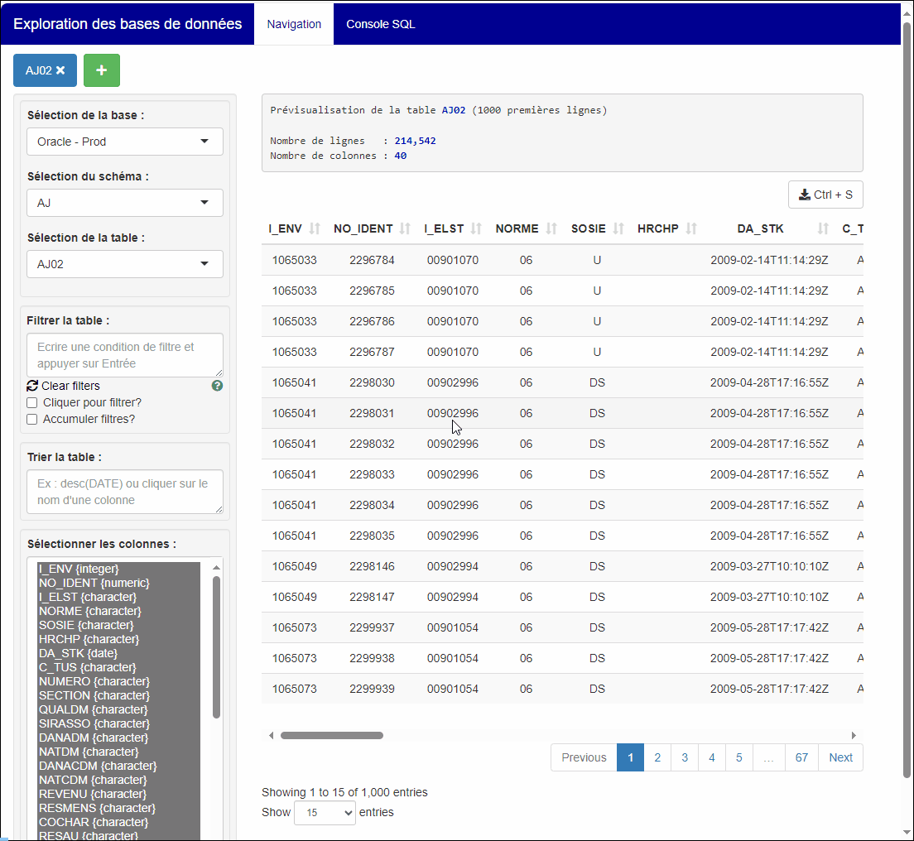

---
title:
output: 
  html_document:
    theme: cerulean
---

# Deux méthodes pour utiliser les filtres : {.tabset}

## **Filtrer en cliquant sur le tableau**
<br>
Lorsque l'option `Cliquer pour filtrer` est activé, un clique sur le tableau de données déclenche le filtre :



## **Filtrer avec une commande manuelle**
<br>
Il est également possible de saisir manuellement des filtres dans la fenêtre de saisie des filtres.

La syntaxe est similaire à celle que l'on appliquerait dans la fonction `filter` du package **`dplyr`**\
Ici sont présentés quelques exemples de syntaxes à faire et à éviter :

<p>

 

</p>

+------------------------------------------------------+---------------------------------------+
| ✅ Syntaxe acceptée                                   | ❌ Syntaxe incorrecte                  |
+======================================================+=======================================+
| **Filtrer sur un élément d'une colonne :**           |                                       |
+------------------------------------------------------+---------------------------------------+
| ```{=html}                                           | ```{=html}                            |
| <pre>                                                | <pre>                                 |
| PER_ID==123456<br>E_IELST==123                       | PER_ID=123456<br>E_IELST=123          |
| </pre>                                               | </pre>                                |
| ```                                                  | ```                                   |
| **Filtrer sur une liste de valeurs :**               |                                       |
+------------------------------------------------------+---------------------------------------+
| ```{=html}                                           | ```{=html}                            |
| <pre>                                                | <pre>                                 |
| i_elst_ca %in% c("00100017","00100018")              | i_elst_ca in c("00100017","00100018") |
| </pre>                                               | </pre>                                |
| ```                                                  | ```                                   |
+------------------------------------------------------+---------------------------------------+
| **Filtrer un texte par recherche de correspondance** |                                       |
+------------------------------------------------------+---------------------------------------+
| ```{=html}                                           | ```{=html}                            |
| <pre>                                                |  <pre>                                |
| COL_TEXTE %like% "%pattern%"                         | COL_TEXTE %like% "pattern"            |
| sql("COL_TEXTE like '%pattern%'")                    | COL_TEXTE like "%pattern%"            |
| </pre>                                               | COL_TEXTE CONTAINS "%pattern%"        |
| ```                                                  | </pre>                                |
|                                                      | ```                                   |
+------------------------------------------------------+---------------------------------------+
