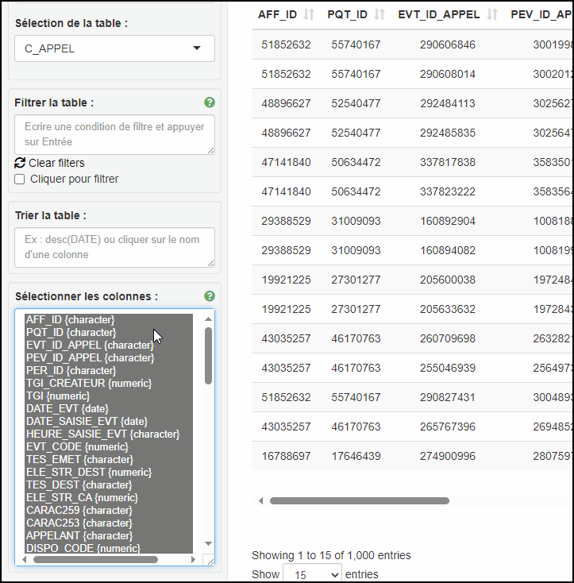

---
title:
output: 
  html_document:
    theme: cerulean
---

# Selection des colonnes

Il est possible de sélectionner plusieurs colonnes en maintenant la touche `Ctrl` enfoncée, puis en cliquant colonne par colonnes ou en restant appuyé sur le clique gauche et en glissant sur les colonnes à conserver.

